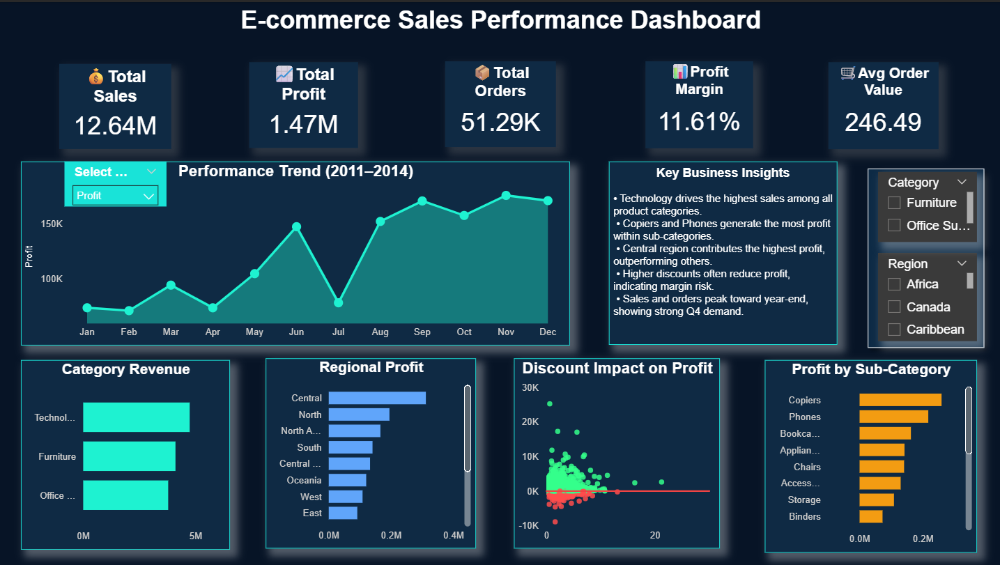

# E-Commerce Sales Performance Dashboard (Power BI)

## Project Overview
This project analyzes e-commerce sales performance using an interactive Power BI dashboard.

The dashboard tracks key business metrics such as revenue, profit, orders, and profitability drivers.

## Key Metrics
- Total Sales
- Total Profit
- Total Orders
- Profit Margin
- Average Order Value

## Dashboard Features
- Interactive metric selector (Revenue / Orders / Profit)
- Trend analysis by month
- Profitability analysis by discount
- Regional performance comparison
- Category and sub-category insights

## Key Business Insights
- Technology generates the highest revenue across categories.
- Copiers and Phones contribute the most profit among sub-categories.
- Central region drives the highest overall profit.
- Higher discounts often reduce profitability.
- Sales and orders peak in Q4.

## Tools Used
- Power BI
- DAX
- Data Visualization
- Data Modeling

## Dataset
Global Superstore dataset used for analysis.

## Dashboard Preview

